# Table processing deep dive

**Quick linksS**
- [Our approach](#our-approach)
- [Content strategy](#content-strategy)
- [Tables in the Natural Questions articles](#tables-in-the-sample-natural-questions-articles)

<p>&nbsp;</p>


## Our approach

When converting HTML to plain text for retrieval-augmented generation (RAG) solutions, extracting information from tables can be challenging.

Our team takes the following approach with HTML tables: Convert the table to column-wise lists and row-wise lists.

**Example**

Imagine you have the following table:
<table>
<caption>Company X employees</caption>
<tr>
<th>Employee name</th>
<th>Employee ID</th>
<th>Department</th>
<th>Salary (US $)</th>
</tr>
<tr>
<td valign="top">Joe Smith</td>
<td valign="top">123456</td>
<td valign="top">Catering</td>
<td valign="top">50,000</td>
</tr>
<tr>
<td valign="top">Alex Babich</td>
<td valign="top">789012</td>
<td valign="top">Reception</td>
<td valign="top">48,000</td>
</tr>
<tr>
<td valign="top">Sam Kelly</td>
<td valign="top">345678</td>
<td valign="top">Sales</td>
<td valign="top">53,000</td>
</tr>
</table>

Our approach would convert this example table to the following lists:

```
### Company X employees

Employee ID:
- ( Employee name ) Joe Smith: 123456
- ( Employee name ) Alex Babich: 789012
- ( Employee name ) Sam Kelly: 345678

Department
- ( Employee name ) Joe Smith: Catering
- ( Employee name ) Alex Babich: Reception
- ( Employee name ) Sam Kelly: Sales

Salary (US $)
- ( Employee name ) Joe Smith: 50,000
- ( Employee name ) Alex Babich: 48,000
- ( Employee name ) Sam Kelly: 53,000

### Company X employees

Joe Smith:
- Employee ID: 123456
- Department: Catering
- Salary (US $): 50,000

Alex Babich:
- Employee ID: 789012
- Department: Reception
- Salary (US $): 48,000

Sam Kelly:
- Employee ID: 345678
- Department: Sales
- Salary (US $): 53,000

```

A table as a concise, visual way to convey attributes of similar objects:
- Each row is an object instance 
- Each column is an attribute
- The first cell of each row (first column) has a special function to identify the object instance

These lists preserve the relationship of the columns (attributes) and rows (instances).

<p>&nbsp;</p>


## Content strategy
Our product documentation team has writing style guidelines that require us to use tables for the purpose decribed above, as opposed to using tables for layout.  Our guidelines also require us to keep our tables simple (avoid `rowspan` and `colspan`) and recommend keepping our tables a reasonable size (eg. fewer than ~10 columns and ~20 rows).

These guidelines pre-dated RAG.  These guidelines make sure our content works well on different screens, helps make translation more successful, and makes our content accessible for people using tools like screen readers.

RAG is just the latest good reason to scrutinize your HTML tables.  Should a table with just two columns really be a list?  Should a table behaving like a sidebar just be implmented with `<div>` elements instead?  Should an enormous table be broken up?

<p>&nbsp;</p>


## Tables in the sample Natural Questions articles

The tables in the Natural Questions articles include real-word challenges: 
- `rowspan`
- `colspan`
- Images in cells
- Using tables for layout instead of the purpose described above

### Example 1
[Abundance of elements in Earth's crust](https://en.wikipedia.org//w/index.php?title=Abundance_of_elements_in_Earth%27s_crust&oldid=801283417)

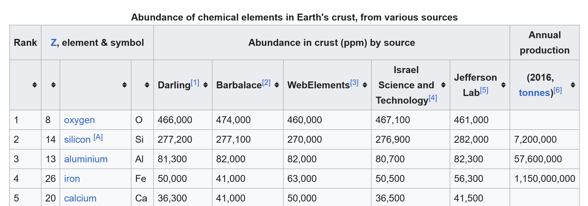

#### Content design comments
- In the first coloumn, why is the column heading "Rank" in the first row and the sorting element on the second row?  Putting both in one cell and using `rowspan=2` would make more sense.
- Similarly, why are the column headings "Z", "element", and "symbol" in the first row?
- Why are the column headings "Z", "element", and "symbol" merged into one cell?  They should each be in their own column.
- The column heading "Rank" is ambiguous.  A heading like "Rank by abundance" would be more clear.
- This table is so large that it's difficult for a reader to navigate and consume.  In general, it's worth exploring other mechanisms for making this information available.
- Making the element name be the first column would make the lists below make much more sense.

#### Lists
[Full text](txt_org/Abundance-of-elements-in-Earths-crust.org.txt)
```
### Abundance of chemical elements in Earth's crust, from various sources:

Z, element & symbol:
- ( Rank ) 1: 8
- ( Rank ) 2: 14
...

Z, element & symbol:
- ( Rank ) 1: oxygen
- ( Rank ) 2: silicon [A]
...

Z, element & symbol:
- ( Rank ) 1: O
- ( Rank ) 2: Si
...

Abundance in crust (ppm) by source Darling:
- ( Rank ) 1: 466,000
- ( Rank ) 2: 277,200
...

...

### Abundance of chemical elements in Earth's crust, from various sources:
1:
- Z, element & symbol: 8
- Z, element & symbol: oxygen
...

2:
- Z, element & symbol: 14
- Z, element & symbol: silicon [A]
...

...
```

<p>&nbsp;</p>


### Example 2
[Atmosphere of Earth](https://en.wikipedia.org//w/index.php?title=Atmosphere_of_Earth&oldid=807367681)

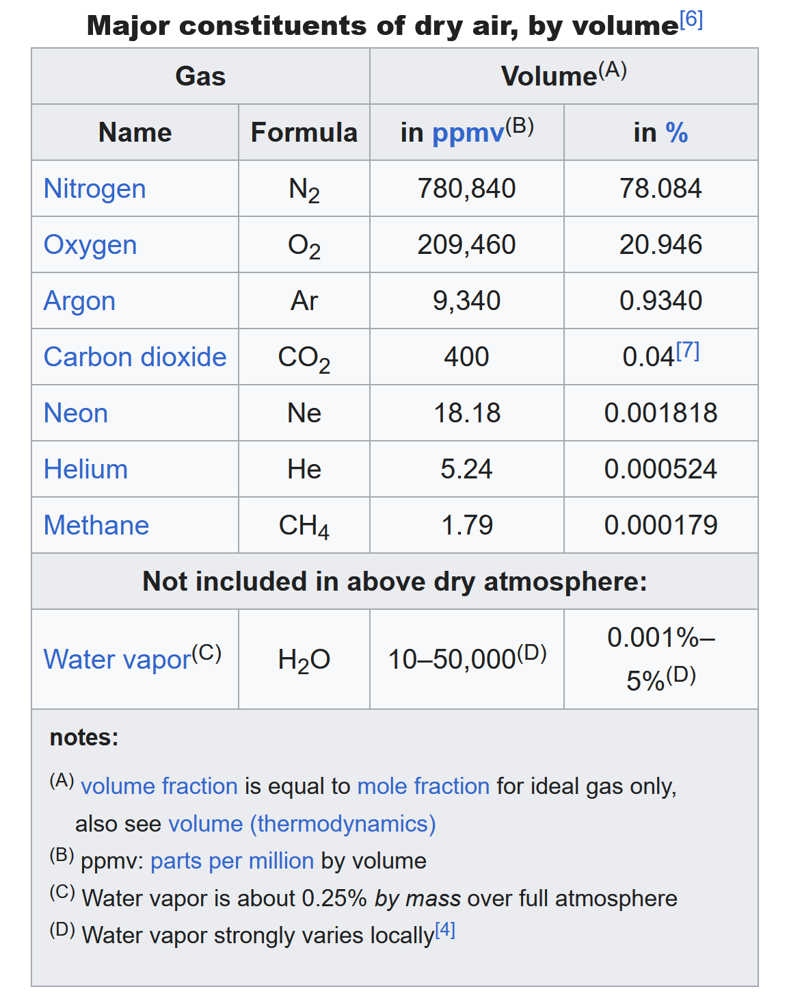

#### Content design comments
- Why is the water vapor information merged into the dry air table?  The water vapor information should probably be pulled out of the table.
- Similarly, why are the "notes" merged into the table?

#### Lists
[Full text](txt_org/Atmosphere-of-Earth.org.txt)
```
### Major constituents of dry air, by volume:

Gas Formula:
- ( Gas Name ) Nitrogen: N2
- ( Gas Name ) Oxygen: O2
...

Volume(A) in ppmv(B):
- ( Gas Name ) Nitrogen: 780,840
- ( Gas Name ) Oxygen: 209,460
...

Volume(A) in %:
- ( Gas Name ) Nitrogen: 78.084
- ( Gas Name ) Oxygen: 20.946
...

### Major constituents of dry air, by volume:
Nitrogen:
- Gas Formula: N2
- Volume(A) in ppmv(B): 780,840
- Volume(A) in %: 78.084

Oxygen:
- Gas Formula: O2
- Volume(A) in ppmv(B): 209,460
- Volume(A) in %: 20.946

...

Methane:
- Gas Formula: CH4
- Volume(A) in ppmv(B): 1.79
- Volume(A) in %: 0.000179

Water vapor(C):
- Gas Formula: H2O
- Volume(A) in ppmv(B): 10–50,000(D)
- Volume(A) in %: 0.001%–5%(D)
```

<p>&nbsp;</p>


### Example 3
[Axial precession](https://en.wikipedia.org//w/index.php?title=Axial_precession&oldid=821770845)

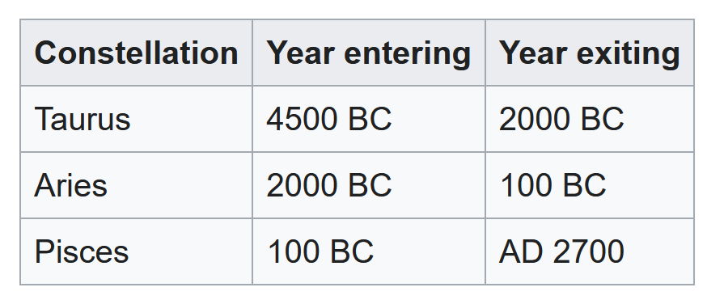

#### Content design comments
- Table has no caption.
- The column headings "Year entering" and "Year exiting" are ambiguous (entering and exiting what?)

#### Lists
[Full text](txt_org/Axial-precession.org.txt)
```
Year entering:
- ( Constellation ) Taurus: 4500 BC
- ( Constellation ) Aries: 2000 BC
- ( Constellation ) Pisces: 100 BC

Year exiting:
- ( Constellation ) Taurus: 2000 BC
- ( Constellation ) Aries: 100 BC
- ( Constellation ) Pisces: AD 2700

Taurus:
- Year entering: 4500 BC
- Year exiting: 2000 BC

Aries:
- Year entering: 2000 BC
- Year exiting: 100 BC

Pisces:
- Year entering: 100 BC
- Year exiting: AD 2700
```

<p>&nbsp;</p>


### Example 4
[Axial precession](https://en.wikipedia.org//w/index.php?title=Axial_precession&oldid=821770845)

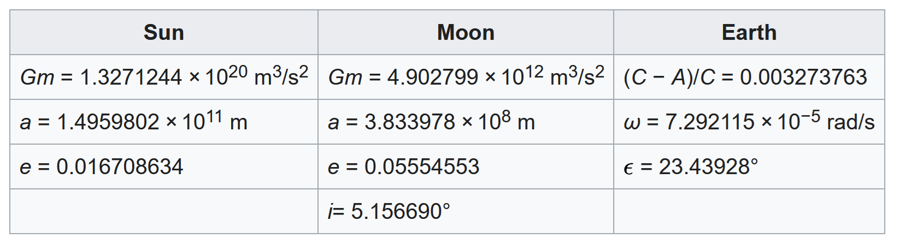

#### Content design comments
- Table has no caption.
- This table is basically three lists side-by-side.
- The variables aren't consistent across the rows.
- There should be a first column for "Variable", with rows having the values for: Gm, a, e, ω, ϵ, and i.

#### Lists
[Full text](txt_org/Axial-precession.org.txt)
```
Moon:
- ( Sun ) Gm = 1.3271244×1020 m3/s2: Gm = 4.902799×1012 m3/s2
- ( Sun ) a = 1.4959802×1011 m: a = 3.833978×108 m
- ( Sun ) e = 0.016708634: e = 0.05554553
- ( Sun ) : i= 5.156690°

Earth:
- ( Sun ) Gm = 1.3271244×1020 m3/s2: (C − A)/C = 0.003273763
- ( Sun ) a = 1.4959802×1011 m: ω = 7.292115×10−5 rad/s
- ( Sun ) e = 0.016708634: ϵ {\displaystyle \epsilon \,\!} = 23.43928°
- ( Sun ) : 

Gm = 1.3271244×1020 m3/s2:
- Moon: Gm = 4.902799×1012 m3/s2
- Earth: (C − A)/C = 0.003273763

a = 1.4959802×1011 m:
- Moon: a = 3.833978×108 m
- Earth: ω = 7.292115×10−5 rad/s

e = 0.016708634:
- Moon: e = 0.05554553
- Earth: ϵ {\displaystyle \epsilon \,\!} = 23.43928°

:
- Moon: i= 5.156690°
- Earth: 
```

<p>&nbsp;</p>


### Example 5
[Axial tilt](https://en.wikipedia.org//w/index.php?title=Axial_tilt&oldid=826622273)

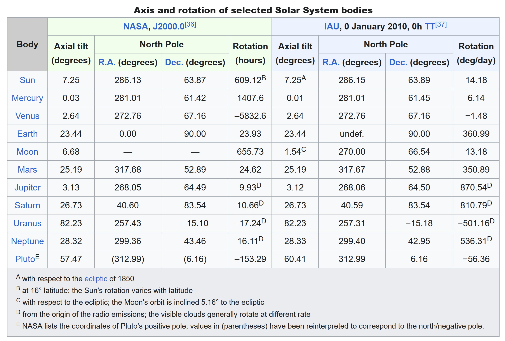

#### Content design comments
- The notes at the bottom should be pulled out of the table.

#### Lists
[Full text](txt_org/Axial-tilt.org.txt)
```
### Axis and rotation of selected Solar System bodies:

NASA, J2000.0 Axial tilt (degrees):
- ( Body ) Sun: 7.25
- ( Body ) Mercury: 0.03
...

NASA, J2000.0 North Pole R.A. (degrees):
- ( Body ) Sun: 286.13
- ( Body ) Mercury: 281.01
...

...

### Axis and rotation of selected Solar System bodies:

Sun:
- NASA, J2000.0 Axial tilt (degrees): 7.25
- NASA, J2000.0 North Pole R.A. (degrees): 286.13
...

Mercury:
- NASA, J2000.0 Axial tilt (degrees): 0.03
- NASA, J2000.0 North Pole R.A. (degrees): 281.01
...

...
```

<p>&nbsp;</p>


### Example 6
[Carbon-cycle](https://en.wikipedia.org//w/index.php?title=Carbon_cycle&oldid=837879153)

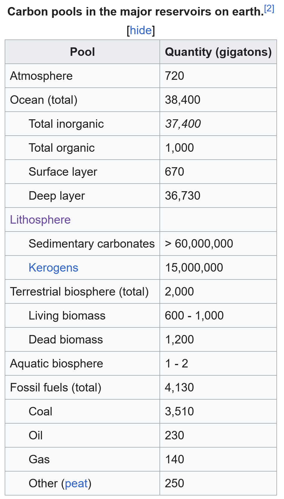

#### Content design comments
- An attempt is made to group carbon pools using indentation to show which pools are a part of a larger pool listed in a row above.  It would be better to use another approach (such as having multiple tables or using lists.)

#### Lists
[Full text](txt_org/Carbon-cycle.org.txt)
```
### Carbon pools in the major reservoirs on earth.:

Quantity (gigatons):
- ( Pool ) Atmosphere: 720
- ( Pool ) Ocean (total): 38,400
...

### Carbon pools in the major reservoirs on earth.:

Atmosphere:
- Quantity (gigatons): 720

Ocean (total):
- Quantity (gigatons): 38,400

Total inorganic:
- Quantity (gigatons): 37,400

...
```

<p>&nbsp;</p>


### Example 7
[Continent](https://en.wikipedia.org//w/index.php?title=Continent&oldid=808552023)

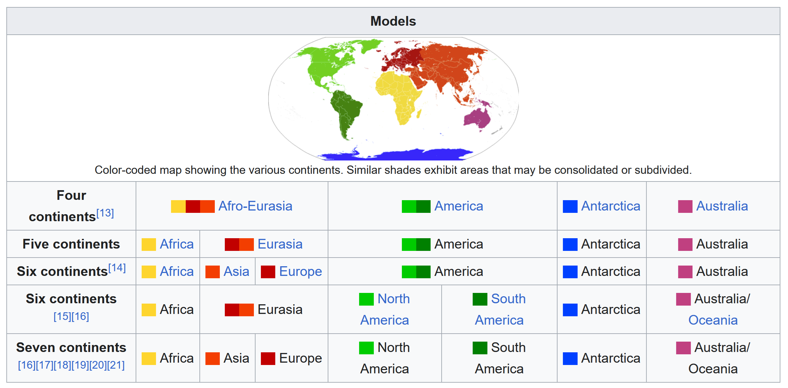

#### Content design comments
- Table has no caption.
- In the first row, a `th` element with `colspan` set to span all the columns is being used as a title for the table. This should be replaced with proper column headings.
- In the second row, a `td` element with `colspan` set to span all the columns is being used for a banner image.  This image should be pulled out of the table.
- Also, color coding will not be picked up in the html-to-text transform.

#### Lists
[Full text](txt_org/Continent.org.txt)
```
Models:
- ( Models ) Color-coded map showing the various continents. Similar shades exhibit areas that may be consolidated or subdivided.: Color-coded map showing the various continents. Similar shades exhibit areas that may be consolidated or subdivided.
- ( Models ) Four continents: Afro-Eurasia
...

Models:
- ( Models ) Color-coded map showing the various continents. Similar shades exhibit areas that may be consolidated or subdivided.: Color-coded map showing the various continents. Similar shades exhibit areas that may be consolidated or subdivided.
- ( Models ) Four continents: Afro-Eurasia
...

...

Color-coded map showing the various continents. Similar shades exhibit areas that may be consolidated or subdivided.:
- Models: Color-coded map showing the various continents. Similar shades exhibit areas that may be consolidated or subdivided.
- Models: Color-coded map showing the various continents. Similar shades exhibit areas that may be consolidated or subdivided.
...

Four continents:
- Models: Afro-Eurasia
- Models: Afro-Eurasia
- Models: Afro-Eurasia
- Models: America
- Models: America
- Models: Antarctica
- Models: Australia
- Models: 

Five continents:
- Models: Africa
- Models: Eurasia
- Models: Eurasia
- Models: America
- Models: America
- Models: Antarctica
- Models: Australia
- Models: 

...
```

<p>&nbsp;</p>


### Example 8
[Continent](https://en.wikipedia.org//w/index.php?title=Continent&oldid=808552023)

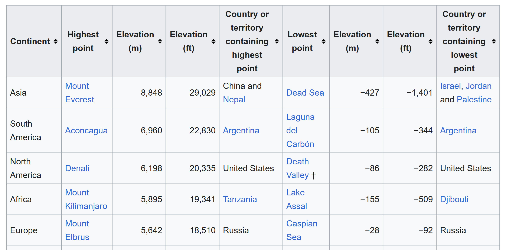

#### Content design comments
- Table has no caption.

#### Lists
[Full text](txt_org/Continent.org.txt)
```
Highest point:
- ( Continent ) Asia: Mount Everest
- ( Continent ) South America: Aconcagua
...

Elevation (m):
- ( Continent ) Asia: 8,848
- ( Continent ) South America: 6,960
...

...


Asia:
- Highest point: Mount Everest
- Elevation (m): 8,848
- Elevation (ft): 29,029
...

South America:
- Highest point: Aconcagua
- Elevation (m): 6,960
...

...
```

<p>&nbsp;</p>


### Example 9
[Crust (geology)](https://en.wikipedia.org//w/index.php?title=Crust_(geology)&oldid=818260704)

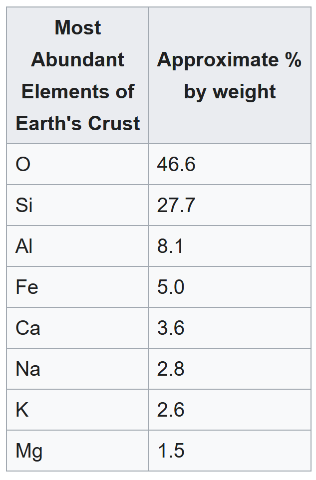

#### Content design comments
- Table has no caption.
- The heading for the first column is too broad.  It would be better to have a table caption like "Most abundant elements of Earth's crust by percent" and for the first column heading to be simply: "Element".

#### Lists
[Full text](txt_org/Crust-geology.org.txt)
```
Approximate % by weight:
- ( Most Abundant Elements of Earth's Crust ) O: 46.6
- ( Most Abundant Elements of Earth's Crust ) Si: 27.7
...


O:
- Approximate % by weight: 46.6

Si:
- Approximate % by weight: 27.7

...
```


<p>&nbsp;</p>


### Example 10
[Crust (geology)](https://en.wikipedia.org//w/index.php?title=Crust_(geology)&oldid=818260704)

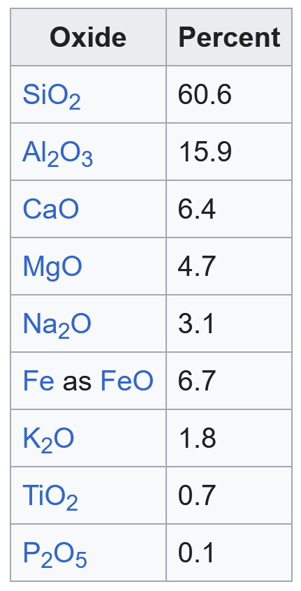

#### Content design comments
- Table has no caption.

#### Lists
[Full text](txt_org/Crust-geology.org.txt)
```
Percent:
- ( Oxide ) SiO2: 60.6
- ( Oxide ) Al2O3: 15.9
...


SiO2:
- Percent: 60.6

Al2O3:
- Percent: 15.9

...
```

<p>&nbsp;</p>


### Example 11
[Earth](https://en.wikipedia.org//w/index.php?title=Earth&oldid=801344840)

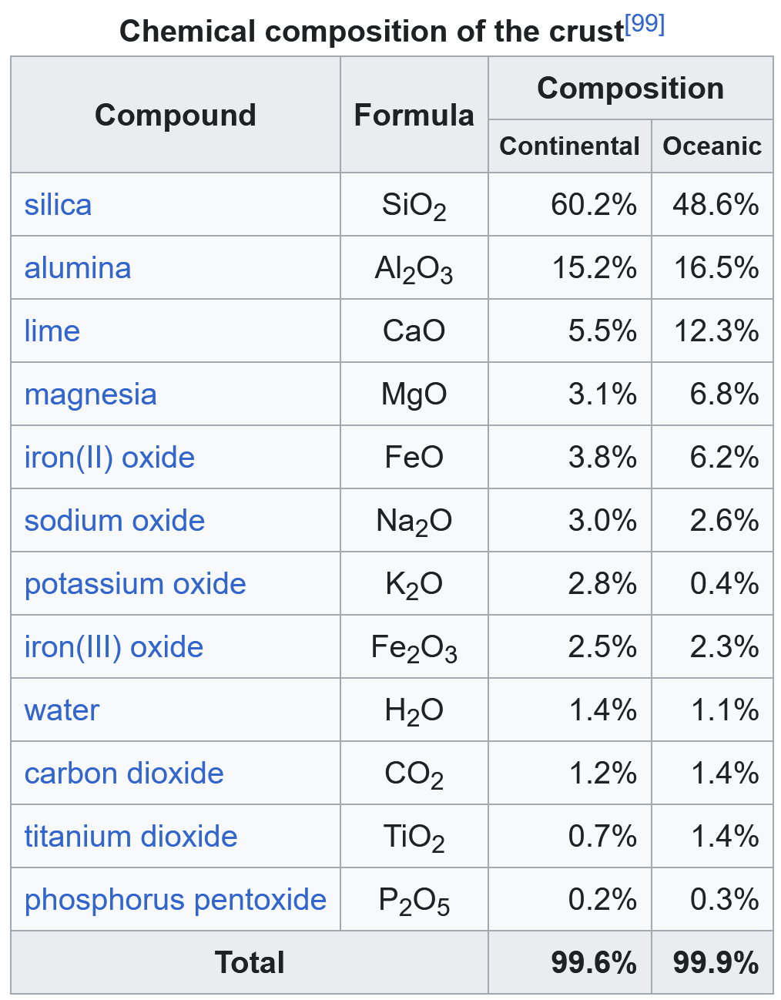

#### Content design comments
- The totals at the bottom should be pulled out of the table.

#### Lists
[Full text](txt_org/Earth.org.txt)
```
### Chemical composition of the crust:

Formula:
- ( Compound ) silica: SiO2
- ( Compound ) alumina: Al2O3
...

Composition Continental:
- ( Compound ) silica: 60.2%
- ( Compound ) alumina: 15.2%
...

...

### Chemical composition of the crust:

silica:
- Formula: SiO2
- Composition Continental: 60.2%
- Composition Oceanic: 48.6%

alumina:
- Formula: Al2O3
- Composition Continental: 15.2%
- Composition Oceanic: 16.5%

...
```

<p>&nbsp;</p>


### Example 12
[Earth](https://en.wikipedia.org//w/index.php?title=Earth&oldid=801344840)

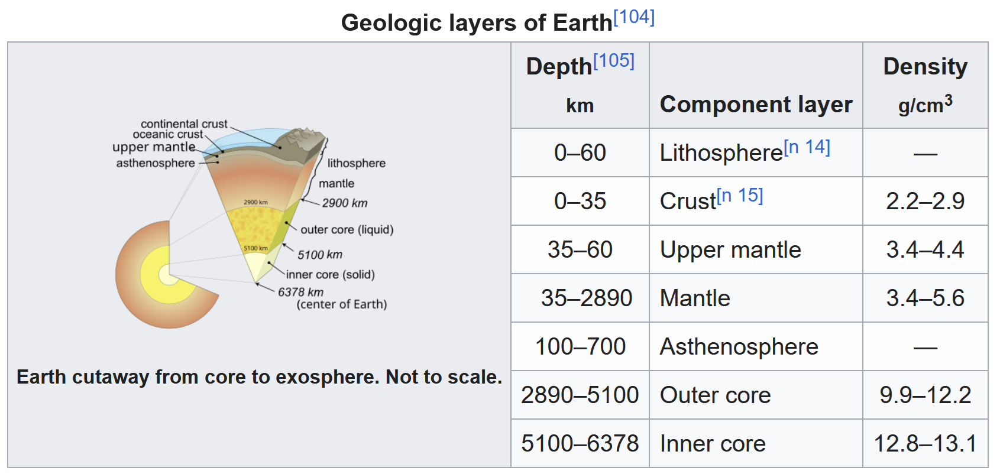

#### Content design comments
- The image should be pulled out of the table.

#### Lists
[Full text](txt_org/Earth.org.txt)
```
### Geologic layers of Earth:

Depth km:
- ( Earth cutaway from core to exosphere. Not to scale. ) : 0–60
- ( Earth cutaway from core to exosphere. Not to scale. ) : 0–35
...

Component layer:
- ( Earth cutaway from core to exosphere. Not to scale. ) : Lithosphere[n 14]
- ( Earth cutaway from core to exosphere. Not to scale. ) : Crust[n 15]
...

### Geologic layers of Earth:

:
- Depth km: 0–60
- Component layer: Lithosphere[n 14]
- Density g/cm3: —

:
- Depth km: 0–35
- Component layer: Crust[n 15]
- Density g/cm3: 2.2–2.9

...
```

<p>&nbsp;</p>


### Example 13
[Earth](https://en.wikipedia.org//w/index.php?title=Earth&oldid=801344840)

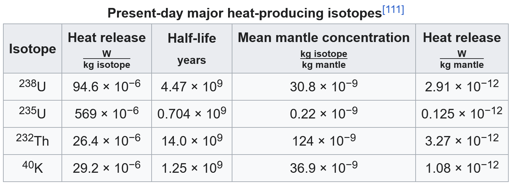

#### Content design comments
None

#### Lists
[Full text](txt_org/Earth.org.txt)
```
### Present-day major heat-producing isotopes:

Heat release W/kg isotope:
- ( Isotope ) 238U: 94.6 × 10−6
- ( Isotope ) 235U: 569 × 10−6
...

Half-life years:
- ( Isotope ) 238U: 4.47 × 109
- ( Isotope ) 235U: 0.704 × 109
...

...

### Present-day major heat-producing isotopes:

238U:
- Heat release W/kg isotope: 94.6 × 10−6
- Half-life years: 4.47 × 109
...

235U:
- Heat release W/kg isotope: 569 × 10−6
- Half-life years: 0.704 × 109
...

...
```

<p>&nbsp;</p>


### Example 14
[Earth](https://en.wikipedia.org//w/index.php?title=Earth&oldid=801344840)

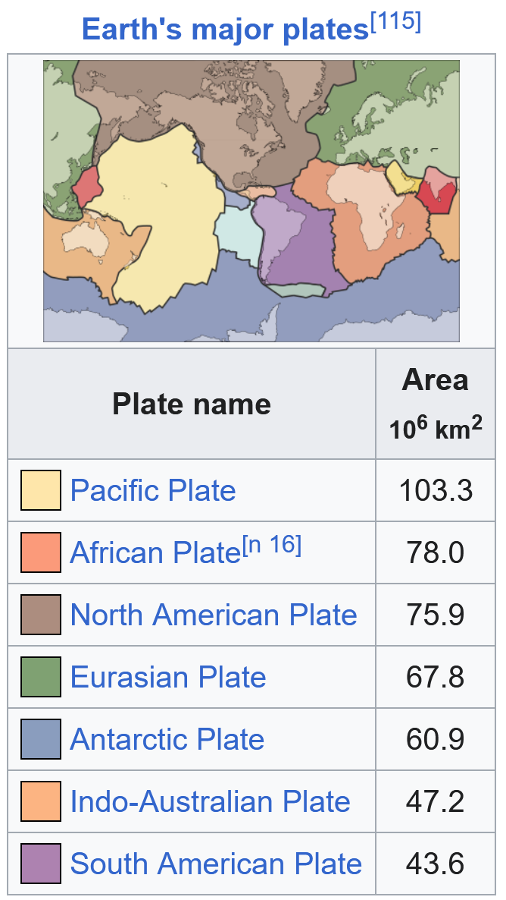

#### Content design comments
- The first row has a `td` element that spans all the columns, containing an image.  That image should be pulled out of the table.

#### Lists
[Full text](txt_org/Earth.org.txt)
```
### Earth's major plates:

Area 106 km2:
- ( Plate name ) Pacific Plate: 103.3
- ( Plate name ) African Plate[n 16]: 78.0
...

### Earth's major plates:
Pacific Plate:
- Area 106 km2: 103.3

African Plate[n 16]:
- Area 106 km2: 78.0

...
```

<p>&nbsp;</p>


### Example 15
[Earth](https://en.wikipedia.org//w/index.php?title=Earth&oldid=801344840)

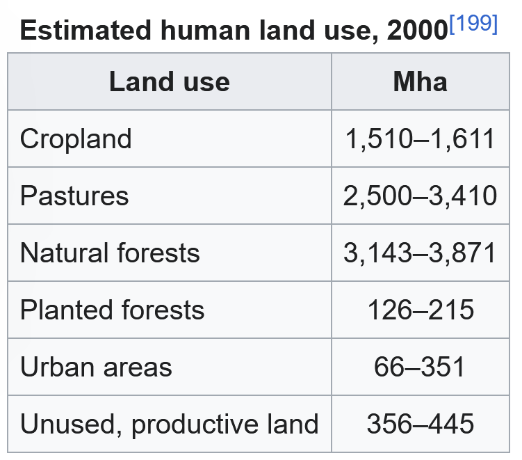

#### Content design comments
None

#### Lists
[Full text](txt_org/Earth.org.txt)
```
### Estimated human land use, 2000:

Mha:
- ( Land use ) Cropland: 1,510–1,611
- ( Land use ) Pastures: 2,500–3,410
...

### Estimated human land use, 2000:
Cropland:
- Mha: 1,510–1,611

Pastures:
- Mha: 2,500–3,410

...
```

<p>&nbsp;</p>


### Example 16
[Earth](https://en.wikipedia.org//w/index.php?title=Earth&oldid=801344840)

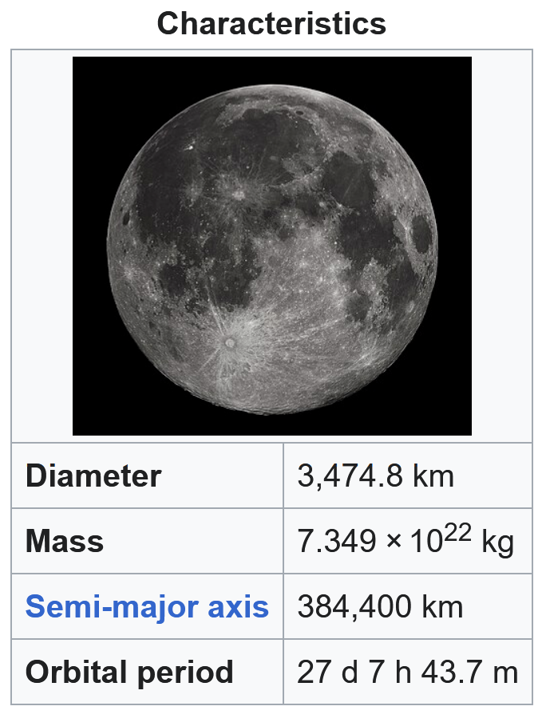

#### Content design comments
- In general, this topic probably has too much detail about too many differnt subjects.  This table about the moon doesn't say "moon" anywhere in it, which risks readers (or LLMs) thinking "Diameter" etc. refers to the Earth.
- There are no column headings.  There should be headings like: "Characheristic", "Value".

#### Lists
[Full text](txt_org/Earth.org.txt)
```
### Characteristics:

:
- 

Diameter:
- 3,474.8 km

Mass:
- 7.349×1022 kg

Semi-major axis:
- 384,400 km

Orbital period:
- 27 d 7 h 43.7 m
```

<p>&nbsp;</p>


### Example 17
[Earth's orbit](https://en.wikipedia.org//w/index.php?title=Earth%27s_orbit&oldid=834440991)

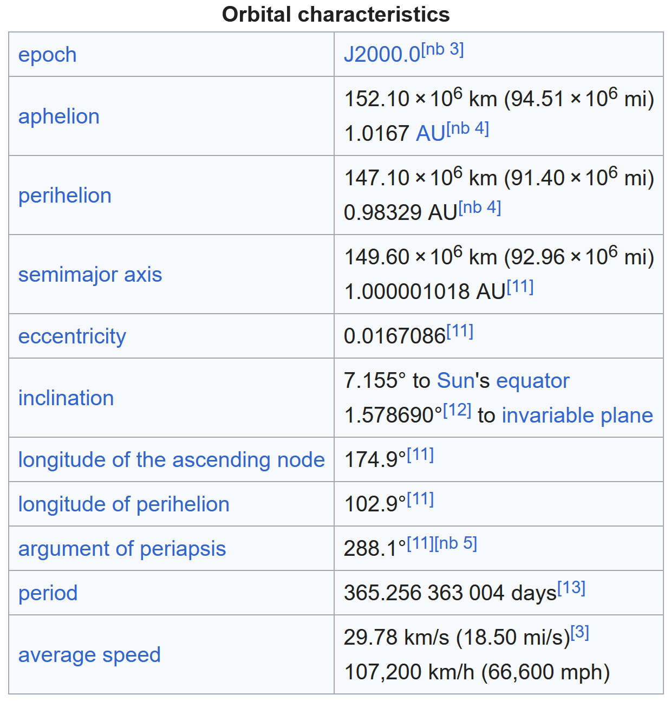

#### Content design comments
- There are no column headings.  There should be headings like: "Characheristic", "Value".

#### Lists
[Full text](txt_org/Earths-orbit.org.txt)
```
### Orbital characteristics:
epoch:
- J2000.0[nb 3]

aphelion:
- 152.10×10^6 km (94.51×10^6 mi) 1.0167 AU[nb 4]

...
```

<p>&nbsp;</p>


### Example 18
[Mantle (geology)](https://en.wikipedia.org//w/index.php?title=Mantle_(geology)&oldid=814508368)

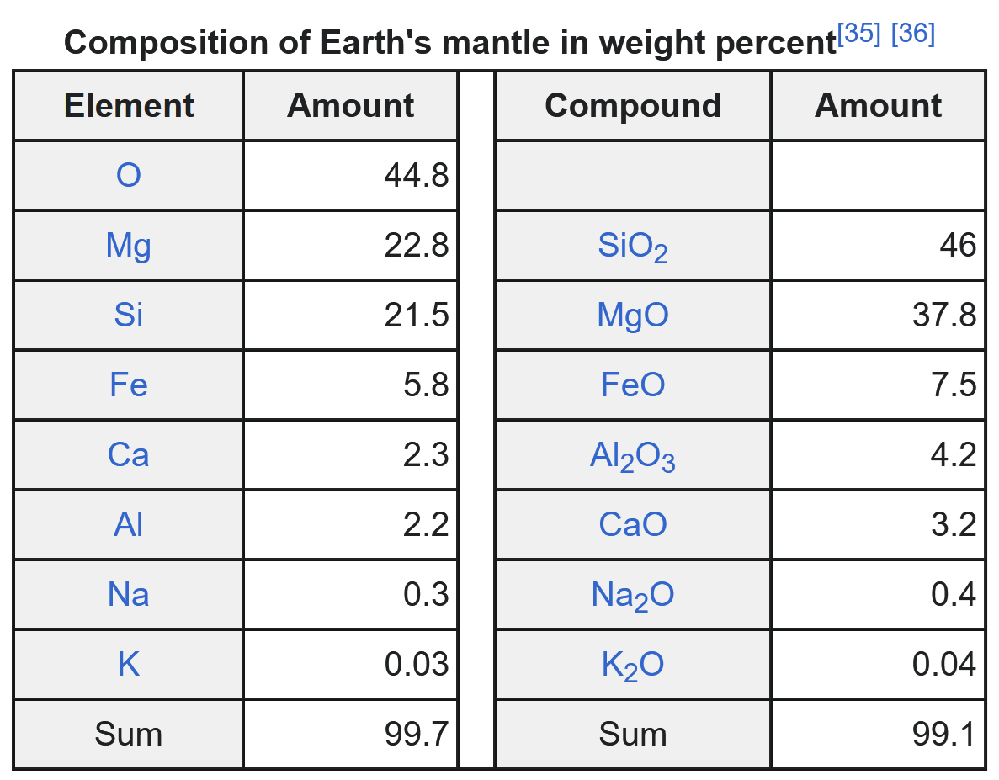

#### Content design comments
- In the header row, there is a cell containing a space character (`&#160;`) with `rowspan=10` the purpose of which seems to be making a horizontal separation between the element columns and the compound columns.  This should be two tables or that spacer should be removed.
- It seems like thr compounds are supposed to align with the elements.  For example, information about the compound MgO should be on the same row as the information about the element Mg.  But several compounds are not on the same row as the corresponding element.  That should be corrected.
- If this information is all to remain in one table, the column heading "Amount" should not be duplicated.  Instead, a more specific heading should be used.

#### Lists
[Full text](txt_org/Mantle-geology.org.txt)
```
Amount:
- ( Element ) O: 44.8
- ( Element ) Mg: 22.8
- ( Element ) Si: 21.5
...

:
- ( Element ) O: 
- ( Element ) Mg: 
- ( Element ) Si: 
...

Compound:
- ( Element ) O: 
- ( Element ) Mg: SiO2
- ( Element ) Si: MgO
...

Amount:
- ( Element ) O: 
- ( Element ) Mg: 46
- ( Element ) Si: 37.8
...

### Composition of Earth's mantle in weight percent:

O:
- Amount: 44.8
- : 
- Compound: 
- Amount: 

Mg:
- Amount: 22.8
- : 
- Compound: SiO2
- Amount: 46

...
```

<p>&nbsp;</p>


### Example 19
[Structure of the Earth](https://en.wikipedia.org//w/index.php?title=Structure_of_the_Earth&oldid=866111969)

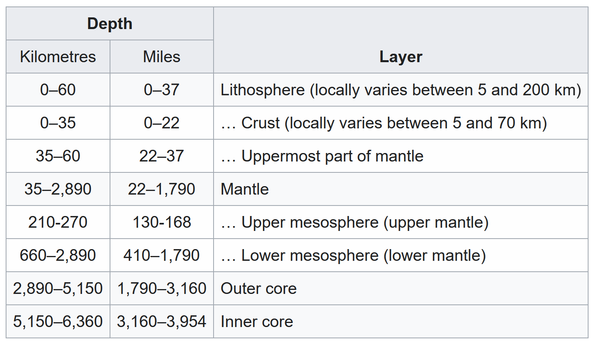

#### Content design comments
- The rows are color-coded and "..." is used to indicate sub-layers that are part of a layer in a row above.  It would be better to use another approach (such as having multiple tables or using lists.)

#### Lists
[Full text](txt_org/Structure-of-the-Earth.org.txt)
```
Depth Miles:
- ( Depth Kilometres ) 0–60: 0–37
- ( Depth Kilometres ) 0–35: 0–22
...

Layer:
- ( Depth Kilometres ) 0–60: 
- ( Depth Kilometres ) 0–35: … Crust (locally varies between 5 and 70 km)
...

0–60:
- Depth Miles: 0–37
- Layer: 

0–35:
- Depth Miles: 0–22
- Layer: … Crust (locally varies between 5 and 70 km)

...
```

<p>&nbsp;</p>


