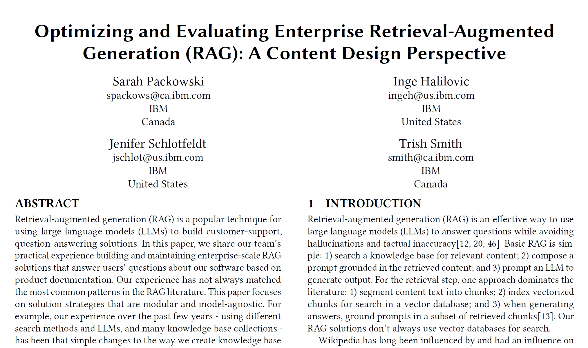
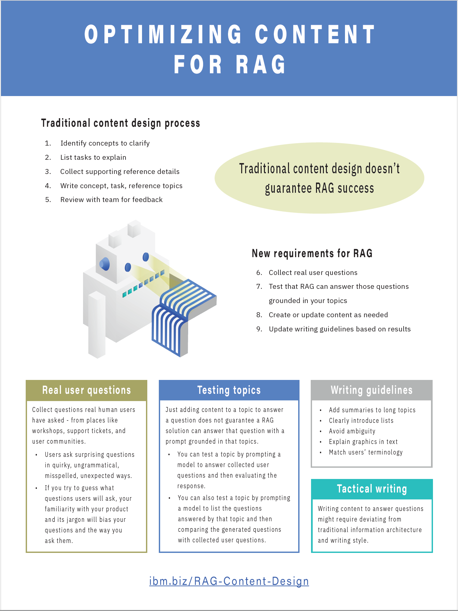
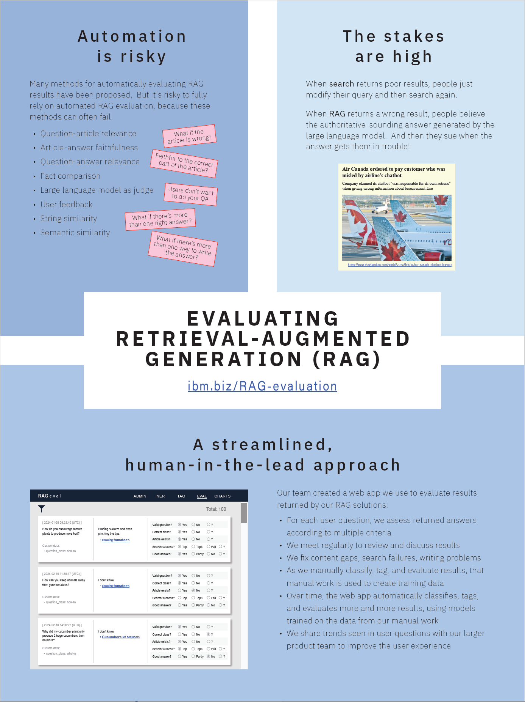
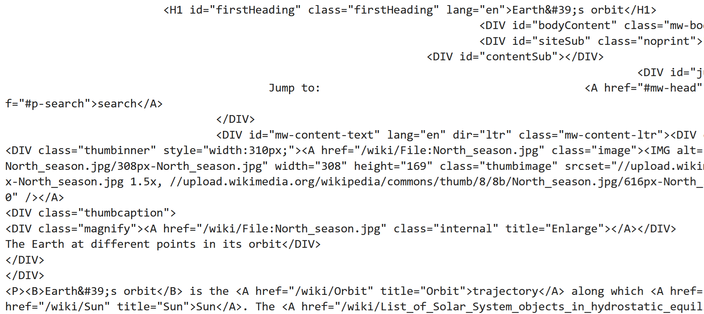
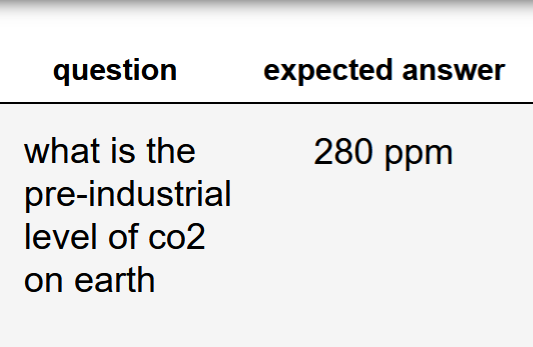
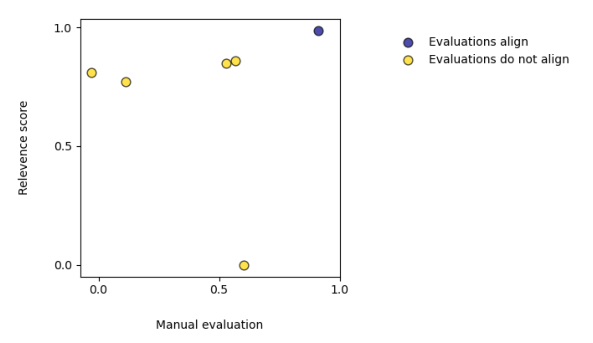
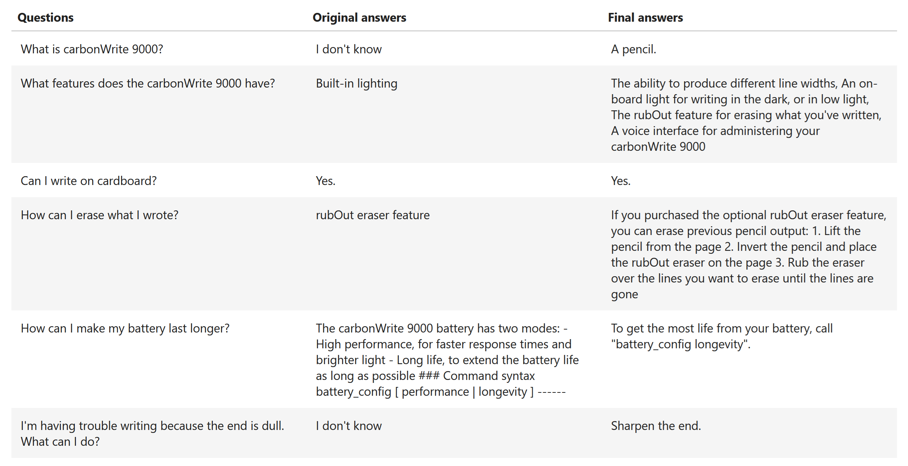

# Optimizing and Evaluating Enterprise Retrieval-Augmented Generation (RAG): A Content Design Perspective

Sarah Packowski ( spackows@ca.ibm.com ) 
Inge Halilovic ( ingeh@us.ibm.com ) 
Jenifer Schlotfeldt ( jschlot@us.ibm.com ) 
Trish Smith ( smith@ca.ibm.com )

This repo contains samples and supporting information for a paper presentation at the: 
**8th International Conference on Advances in Artificial Intelligence (ICAAI 2024)** 
https://www.icaai.org

&nbsp;

**Quick links:**
- [Paper](#paper)
- [Presentation](#presentation)
- [Posters](#posters)
- [Blog posts](#blog-posts)
- [Content rewriting experiment](Natural-Questions/README.md)
- [Sample notebooks](#sample-notebooks)

&nbsp;

## Paper
[Link to PDF](RAG-A-CD-Perspective.pdf)

&nbsp;

## Presentation
- [Slides](RAG-A-CD-Perspective_presentation-slides.pdf)
- [Video](https://youtu.be/4ZPe-8rAl-k)

&nbsp;

## Posters
These posters were presented at [CASCON](https://cascon.ca) 2024:
<table>
<tr>
<th>Poster</th>
<th>Description</th>
</tr>
<tr>
<td valign="top">

Optimizing&nbsp;content&nbsp;for&nbsp;RAG

</td>
<td valign="top">

This poster describes how content teams must adapt their processes in the era of RAG: adopt question-driven content development.

<i>Special thanks:</i>

<ul>
<li>Design concept: Chloe Maceda (<mailto>chloe.maceda@ibm.com</mailto>)</li>
<li>Robot graphic: Malik Johnson (<mailto>Malik.Johnson@ibm.com</mailto>)</li>
</ul>

Download: <a href="posters/optimizing-content_CASCON-2024.pdf">Poster</a>

</td>
</tr>
<tr>
<td valign="top">

Evaluating&nbsp;RAG

</td>
<td valign="top">

This poster describes why it is risky to rely on only automated evaluation of RAG solutions, and proposes a human-in-the-lead approach to RAG evaluation.

Download: <a href="posters/RAG-evaluation_CASCON-2024.pdf">Poster</a>

</td>
</tr>
</table>

&nbsp;

## Blog posts
- [Adapting content for AI](https://medium.com/@ingeh/adapting-content-for-ai-improving-accuracy-of-rag-solutions-4ab7a6d708a5)
- [Preparing and repairing content for AI](https://ingeh.medium.com/adapting-content-for-ai-preparing-and-repairing-our-content-for-rag-a0d24c2d1ae9)
- [Question-driven content design](https://medium.com/@sarah-packowski/question-driven-content-design-ba373215e634)
- [How publishers need to adapt in the era of RAG](https://medium.com/@sarah-packowski/how-publishers-need-to-adapt-in-the-era-of-rag-64ebe2c95540)
- [Is your data RAG ready?](https://medium.com/@sarah-packowski/is-your-data-rag-ready-2a3842f0dc69)
- [Trying to fully automate evaluation of deployed RAG solutions is risky](https://sarah-packowski.medium.com/trying-to-fully-automate-evaluation-of-deployed-rag-solutions-is-risky-164e2a5ba1bd)
- [The role of technical writers in the age of RAG and agentic LLM solutions](https://medium.com/@sarah-packowski/the-role-of-technical-writers-in-the-age-of-rag-and-agentic-llm-solutions-e1196a4847da)

&nbsp;

## Sample notebooks
These sample notebooks demonstrate the ideas described in the paper above.

**Running these notebooks**
- These notebooks can run in the notebook editor of [IBM watsonx.ai](https://www.ibm.com/products/watsonx-ai)
- Notebooks 1 - 10 can run on the smallest run-time environment
- Notebook 11 requires one of the larger environments

<table>
<tr>
<th valign="top">Notebook</th>
<th valign="top">Description</th>
</tr>
<!-- 1. Filter input -->
<tr>
<td valign="top">

<b>1.&nbsp;Filter&nbsp;input</b>&nbsp;(&nbsp;<a href="notebooks/01_filter.ipynb">link</a>&nbsp;)

&nbsp;

</td>
<td valign="top">

Use the <a href="https://cloud.ibm.com/catalog/services/natural-language-understanding">Natural Langauge Understanding</a> service on IBM Cloud to filter out malicious input (eg. Javascript injection)

</td>
</tr>
<!-- 2. Classify input -->
<tr>
<td valign="top">

<b>2.&nbsp;Classify&nbsp;input</b>&nbsp;(&nbsp;<a href="notebooks/02_classify.ipynb">link</a>&nbsp;)

&nbsp;

</td>
<td valign="top">

Use a large language model in <a href="https://www.ibm.com/products/watsonx-ai">IBM watsonx.ai</a> to classify user input into one of these categories:
<ul>
<li>Keyword search</li>
<li>Question (including question type)</li>
<li>Instruction</li>
</ul>

</td>
</tr>
<!-- 3. Remove HAP, PII -->
<tr>
<td valign="top">

<b>3.&nbsp;Remove&nbsp;HAP,&nbsp;PII</b>&nbsp;(&nbsp;<a href="notebooks/03_hap.ipynb">link</a>&nbsp;)

&nbsp;

</td>
<td valign="top">

Remove hate, abuse, and profanity (HAP) as well as personal identifiable information (PII)

</td>
</tr>
<!-- 4. Identify FAQs -->
<tr>
<td valign="top">

<b>4.&nbsp;Identify&nbsp;FAQs</b>&nbsp;(&nbsp;<a href="notebooks/04_faq.ipynb">link</a>&nbsp;)

&nbsp;

</td>
<td valign="top">

Match a given question with frequently asked questions

</td>
</tr>
<!-- 5. Boost search -->
<tr>
<td valign="top">

<b>5.&nbsp;Boost&nbsp;search</b>&nbsp;(&nbsp;<a href="notebooks/05_search.ipynb">link</a>&nbsp;)

&nbsp;

</td>
<td valign="top">

Improve search success using several techniques:
<ul>
<li>Add synonyms</li>
<li>Rewrite query</li>
</ul>

</td>
</tr>
<!-- 6. Prompt by question type -->
<tr>
<td valign="top">

<b>6.&nbsp;Prompt&nbsp;by&nbsp;question&nbsp;type</b>&nbsp;(&nbsp;<a href="notebooks/06_prompt.ipynb">link</a>&nbsp;)

&nbsp;

</td>
<td valign="top">

Given relevant articles from a knowledge base, prompt a large language model to format answers to questions differently, depending on the question type:
<ul>
<li>What-is</li>
<li>How-to</li>
</ul>

</td>
</tr>
<!-- 7. Select best answer -->
<tr>
<td valign="top">

<b>7.&nbsp;Select&nbsp;best&nbsp;answer</b>&nbsp;(&nbsp;<a href="notebooks/07_best-answer.ipynb">link</a>&nbsp;)

&nbsp;

</td>
<td valign="top">

Select the best of several generated answers

</td>
</tr>
<!-- 08. Regression testing -->
<tr>
<td valign="top">

<b>8.&nbsp;Regression&nbsp;testing</b>&nbsp;(&nbsp;<a href="notebooks/08_regression.ipynb">link</a>&nbsp;)

&nbsp;

</td>
<td valign="top">

Test whether a change to the RAG solution causes the solution to get better or worse

</td>
</tr>
<!-- 09. Testing topics -->
<tr>
<td valign="top">

<b>9.&nbsp;Testing&nbsp;topics</b>&nbsp;(&nbsp;<a href="notebooks/09_test-topics.ipynb">link</a>&nbsp;)

&nbsp;

</td>
<td valign="top">

Test how well a topic can answer given user questions

</td>
</tr>
<!-- 10. HTML to text -->
<tr>
<td valign="top">

<b>10.&nbsp;HTML&nbsp;to&nbsp;text</b>&nbsp;(&nbsp;<a href="notebooks/10_html-text.ipynb">link</a>&nbsp;)

&nbsp;

</td>
<td valign="top">

Convert HTML to text

</td>
</tr>
<!-- 11. Answer Natural Questions benchmark -->
<tr>
<td valign="top">

<b>11.&nbsp;Answer&nbsp;Natural&nbsp;Questions</b>&nbsp;(&nbsp;<a href="notebooks/11_answer-natural-questions.ipynb">link</a>&nbsp;)

&nbsp;

</td>
<td valign="top">

Answer a subset of questions from the <a href="https://research.google/pubs/natural-questions-a-benchmark-for-question-answering-research/">Natural Questions benchmark</a>

</td>
</tr>
<!-- 12. Compare RAGAs ResponseRelevancy metric with manual evaluation -->
<tr>
<td valign="top">

<b>12.&nbsp;Compare RAGAs ResponseRelevancy metric with manual evaluation</b>&nbsp;(&nbsp;<a href="notebooks/12_RAGAs-ResponseRelevancy-experiment.ipynb">link</a>&nbsp;)

&nbsp;

</td>
<td valign="top">

Apply the <a href="https://arxiv.org/abs/2309.15217">RAGAs</a> <a href="https://docs.ragas.io/en/stable/concepts/metrics/available_metrics/answer_relevance">ResponseRelevancy</a> metric to some RAG results, and then compare with manual evaluation

</td>
</tr>
<!-- 13. The effect of information-typed, topic-based writing on RAG success -->
<tr>
<td valign="top">

<b>13.&nbsp;Improving results with information typing</b>&nbsp;(&nbsp;<a href="notebooks/13_carbonWrite-RAG.ipynb">link</a>&nbsp;)

&nbsp;

</td>
<td valign="top">

Demonstrates how a knowledge base of information-typed topics yields better answers than a knowledge base without this content architecture

</td>
</tr>
</table>
