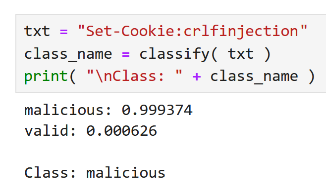
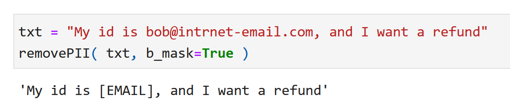
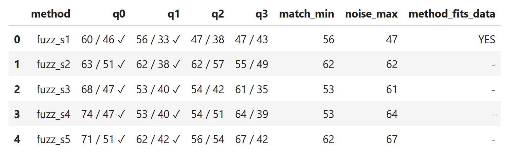
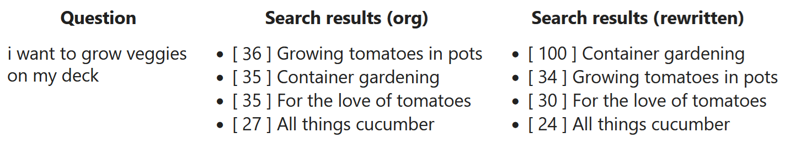
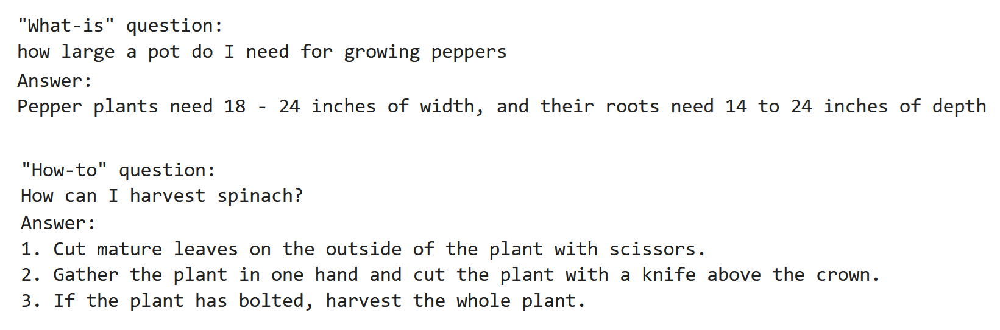
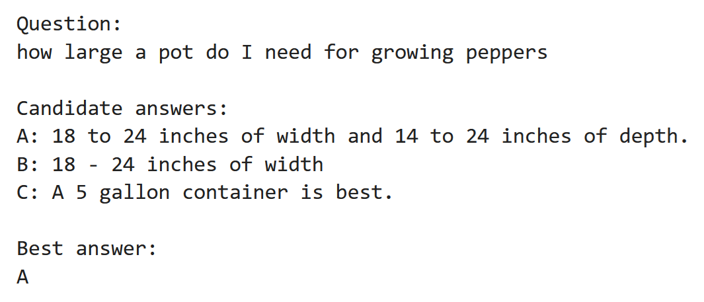
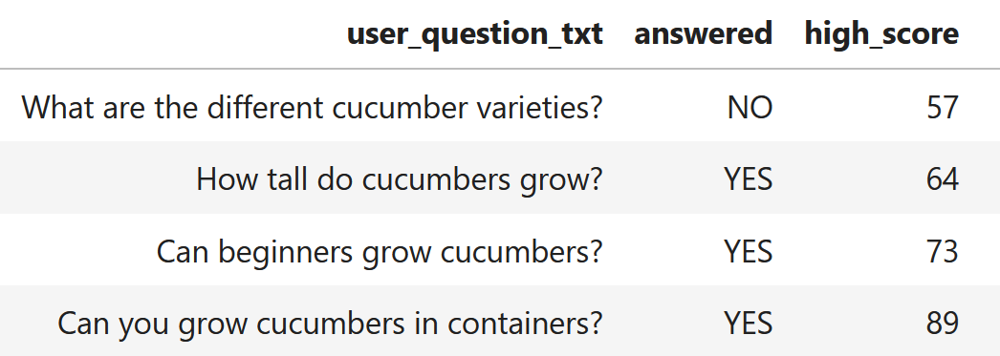

# RAG CD perspective
Samples related to Content Design for retrieval-augmented generation (RAG)

## Sample notebooks
<table>
<tr>
<th valign="top">Notebook</th>
<th valign="top">Description</th>
</tr>
<!-- 1. Filter input -->
<tr>
<td valign="top">

<b>1.&nbsp;Filter&nbsp;input</b>&nbsp;(&nbsp;<a href="notebooks/01_filter.ipynb">Link</a>&nbsp;)

</td>
<td valign="top">

Filter out the following malicious input:
<ul>
<li>Javascript injection</li>
<li>Prompt injection</li>
</ul>

</td>
</tr>
<!-- 2. Classify input -->
<tr>
<td valign="top">

<b>2.&nbsp;Classify&nbsp;input</b>&nbsp;(&nbsp;<a href="notebooks/02_classify-input.ipynb">Link</a>&nbsp;)

</td>
<td valign="top">

Classify user input into one of these categories:
<ul>
<li>Keyword search</li>
<li>Question (including question type)</li>
<li>Instruction</li>
</ul>

</td>
</tr>
<!-- 3. Identify HAP -->
<tr>
<td valign="top">

<b>3.&nbsp;Identify&nbsp;HAP</b>&nbsp;(&nbsp;<a href="notebooks/03_hap.ipynb">Link</a>&nbsp;)

</td>
<td valign="top">

Identify hate, abuse, and profanity

</td>
</tr>
<!-- 4. Identify FAQ -->
<tr>
<td valign="top">

<b>4.&nbsp;Identify&nbsp;FAQ</b>&nbsp;(&nbsp;<a href="notebooks/04_faq.ipynb">Link</a>&nbsp;)

</td>
<td valign="top">

Match given question with frequently asked question

</td>
</tr>
<!-- 5. Boost search -->
<tr>
<td valign="top">

<b>5.&nbsp;Boost&nbsp;search</b>&nbsp;(&nbsp;<a href="notebooks/05_search.ipynb">Link</a>&nbsp;)

</td>
<td valign="top">

Improve search success using several techniques:
<ul>
<li>Add synonyms</li>
<li>Rewrite query</li>
</ul>

</td>
</tr>
<!-- 6. Prompt by question type -->
<tr>
<td valign="top">

<b>6.&nbsp;Prompt&nbsp;by&nbsp;question&nbsp;type</b>&nbsp;(&nbsp;<a href="notebooks/06_prompt.ipynb">Link</a>&nbsp;)

</td>
<td valign="top">

Given relevant articles from a knowledge base, prompt a large language model to answer a question

</td>
</tr>
<!-- 7. Select best answer -->
<tr>
<td valign="top">

<b>7.&nbsp;Select&nbsp;best&nbsp;answer</b>&nbsp;(&nbsp;<a href="notebooks/07_best-answer.ipynb">Link</a>&nbsp;)

</td>
<td valign="top">

Select the best of several generated answers

</td>
</tr>
<!-- 08. Test topics -->
<tr>
<td valign="top">

<b>8.&nbsp;Test&nbsp;topics</b>&nbsp;(&nbsp;<a href="notebooks/08_testing-topics.ipynb">Link</a>&nbsp;)

</td>
<td valign="top">

Test how well a topic can answer given user questions

</td>
</tr>
<!-- 09. Answering Natural Questions benchmark -->
<tr>
<td valign="top">

<b>9.&nbsp;Answering&nbsp;Natural&nbsp;Questions</b>&nbsp;(&nbsp;<a href="notebooks/09_nq.ipynb">Link</a>&nbsp;)

</td>
<td valign="top">

Answer a subset of questions from the <a href="https://research.google/pubs/natural-questions-a-benchmark-for-question-answering-research/">Natural Questions benchmark</a>

</td>
</tr>
</table>
