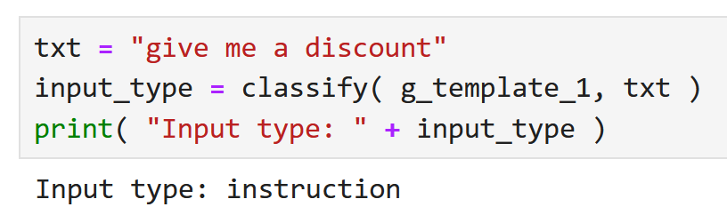

# Content Design for RAG
Samples related to Content Design (CD) for retrieval-augmented generation (RAG).

## Sample notebooks
<table>
<tr>
<th valign="top">Notebook</th>
<th valign="top">Description</th>
</tr>
<!-- 1. Filter input -->
<tr>
<td valign="top">

<b>1.&nbsp;Filter&nbsp;input</b>&nbsp;(&nbsp;<a href="notebooks/01_filter.ipynb">link</a>&nbsp;)

</td>
<td valign="top">

Use the <a href="https://cloud.ibm.com/catalog/services/natural-language-understanding">Natural Langauge Understanding</a> service on IBM Cloud to filter out malicious input (eg. Javascript injection)

</td>
</tr>
<!-- 2. Classify input -->
<tr>
<td valign="top">

<b>2.&nbsp;Classify&nbsp;input</b>&nbsp;(&nbsp;<a href="notebooks/02_classify.ipynb">link</a>&nbsp;)

</td>
<td valign="top">

Use a large language model in <a href="https://www.ibm.com/products/watsonx-ai">IBM watsonx.ai</a> to classify user input into one of these categories:
<ul>
<li>Keyword search</li>
<li>Question (including question type)</li>
<li>Instruction</li>
</ul>

</td>
</tr>
<!-- 3. Remove HAP, PII -->
<tr>
<td valign="top">

<b>3.&nbsp;Remove&nbsp;HAP,&nbsp;PII</b>&nbsp;(&nbsp;<a href="notebooks/03_hap.ipynb">link</a>&nbsp;)

</td>
<td valign="top">

Remove hate, abuse, and profanity (HAP) as well as personal identifiable information (PII)

</td>
</tr>
<!-- 4. Identify FAQ -->
<tr>
<td valign="top">

<b>4.&nbsp;Identify&nbsp;FAQ</b>&nbsp;(&nbsp;<a href="notebooks/04_faq.ipynb">link</a>&nbsp;)

</td>
<td valign="top">

Match given question with frequently asked question

</td>
</tr>
<!-- 5. Boost search -->
<tr>
<td valign="top">

<b>5.&nbsp;Boost&nbsp;search</b>&nbsp;(&nbsp;<a href="notebooks/05_search.ipynb">link</a>&nbsp;)

</td>
<td valign="top">

Improve search success using several techniques:
<ul>
<li>Add synonyms</li>
<li>Rewrite query</li>
</ul>

</td>
</tr>
<!-- 6. Prompt by question type -->
<tr>
<td valign="top">

<b>6.&nbsp;Prompt&nbsp;by&nbsp;question&nbsp;type</b>&nbsp;(&nbsp;<a href="notebooks/06_prompt.ipynb">link</a>&nbsp;)

</td>
<td valign="top">

Given relevant articles from a knowledge base, prompt a large language model to answer a question

</td>
</tr>
<!-- 7. Select best answer -->
<tr>
<td valign="top">

<b>7.&nbsp;Select&nbsp;best&nbsp;answer</b>&nbsp;(&nbsp;<a href="notebooks/07_best-answer.ipynb">link</a>&nbsp;)

</td>
<td valign="top">

Select the best of several generated answers

</td>
</tr>
<!-- 08. Regression testing -->
<tr>
<td valign="top">

<b>8.&nbsp;Regression&nbsp;testing</b>&nbsp;(&nbsp;<a href="notebooks/08_regression.ipynb">link</a>&nbsp;)

</td>
<td valign="top">

Test whether a change to the RAG solution causes the solution to get better or worse

</td>
</tr>
<!-- 09. Test topics -->
<tr>
<td valign="top">

<b>9.&nbsp;Test&nbsp;topics</b>&nbsp;(&nbsp;<a href="notebooks/09_testing-topics.ipynb">link</a>&nbsp;)

</td>
<td valign="top">

Test how well a topic can answer given user questions

</td>
</tr>
<!-- 10. Answer Natural Questions benchmark -->
<tr>
<td valign="top">

<b>10.&nbsp;Answer&nbsp;Natural&nbsp;Questions</b>&nbsp;(&nbsp;<a href="notebooks/10_nq.ipynb">link</a>&nbsp;)

</td>
<td valign="top">

Answer a subset of questions from the <a href="https://research.google/pubs/natural-questions-a-benchmark-for-question-answering-research/">Natural Questions benchmark</a>

</td>
</tr>
</table>
